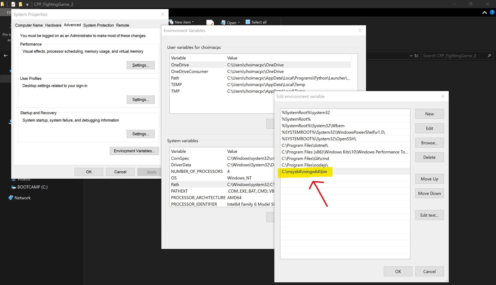

# CPPFG2 by Roundbeargames

Indie game developer from South Korea
<br>
https://youtube.com/roundbeargames

<br>

# Windows 10 Build
- Install packages
<br> *I'm using [MSYS2](https://www.msys2.org/)*

```
pacman -Syu
pacman -Su
pacman -S mingw-w64-x86_64-cmake
pacman -S mingw-w64-x86_64-ninja
pacman -S mingw-w64-x86_64-gcc
pacman -S mingw-w64-x86_64-clang
pacman -S mingw-w64-x86_64-libc++ mingw-w64-x86_64-libc++abi
```

<br>

- Add path for the packages
<br>



<br>
<br>

- Clone repository and build
<br> *pls refer to my [CMakeLists.txt](https://github.com/RoundBearChoi/CPP_FightingGame_2/blob/main/CMakeLists.txt)*

```
git clone https://github.com/RoundBearChoi/CPP_FightingGame_2
cd CPP_FightingGame_2

mkdir build
cd build

cmake -G "Ninja" ..
ninja
```

<br>


<br>

# License (OLC-3)

Copyright 2018 - 2024 OneLoneCoder.com

Redistribution and use in source and binary forms, with or without modification,
are permitted provided that the following conditions are met:

1. Redistributions or derivations of source code must retain the above copyright
notice, this list of conditions and the following disclaimer.

2. Redistributions or derivative works in binary form must reproduce the above
copyright notice. This list of conditions and the following	disclaimer must be
reproduced in the documentation and/or other materials provided with the distribution.

3. Neither the name of the copyright holder nor the names of its contributors may
be used to endorse or promote products derived from this software without specific
prior written permission.

THIS SOFTWARE IS PROVIDED BY THE COPYRIGHT HOLDERS AND CONTRIBUTORS	"AS IS" AND ANY
EXPRESS OR IMPLIED WARRANTIES, INCLUDING, BUT NOT LIMITED TO, THE IMPLIED WARRANTIES
OF MERCHANTABILITY AND FITNESS FOR A PARTICULAR PURPOSE ARE DISCLAIMED. IN NO EVENT
SHALL THE COPYRIGHT	HOLDER OR CONTRIBUTORS BE LIABLE FOR ANY DIRECT, INDIRECT,
INCIDENTAL,	SPECIAL, EXEMPLARY, OR CONSEQUENTIAL DAMAGES (INCLUDING, BUT NOT LIMITED
TO, PROCUREMENT OF SUBSTITUTE GOODS OR SERVICES; LOSS OF USE, DATA, OR PROFITS; OR
BUSINESS INTERRUPTION) HOWEVER CAUSED AND ON ANY THEORY OF LIABILITY, WHETHER IN
CONTRACT, STRICT LIABILITY, OR TORT	(INCLUDING NEGLIGENCE OR OTHERWISE) ARISING IN
ANY WAY OUT OF THE USE OF THIS SOFTWARE, EVEN IF ADVISED OF THE POSSIBILITY OF
SUCH DAMAGE.

Links
~~~~~
YouTube:	https://www.youtube.com/javidx9
            https://www.youtube.com/javidx9extra
Discord:	https://discord.gg/WhwHUMV
Twitter:	https://www.twitter.com/javidx9
Twitch:		https://www.twitch.tv/javidx9
GitHub:		https://www.github.com/onelonecoder
Homepage:	https://www.onelonecoder.com
Patreon:	https://www.patreon.com/javidx9
Community:  https://community.onelonecoder.com